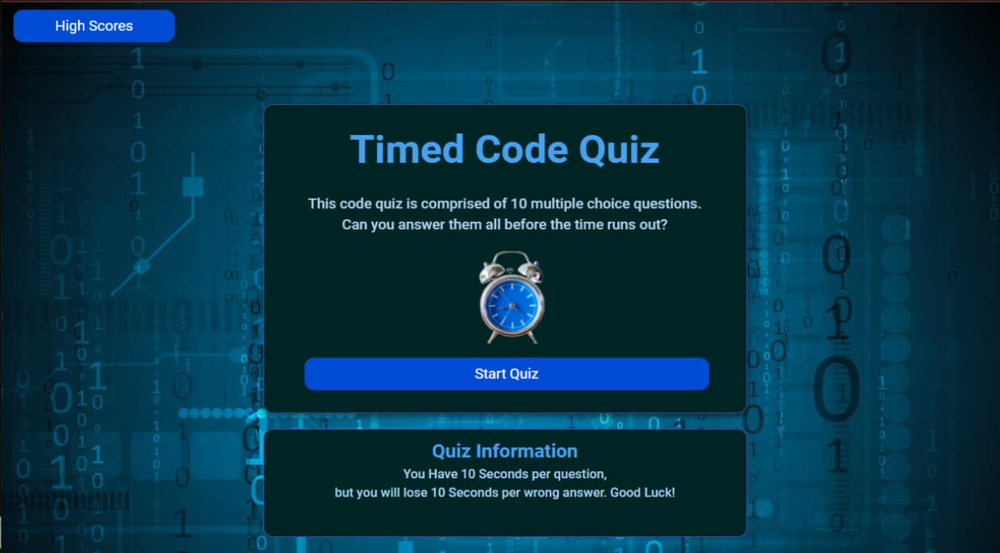
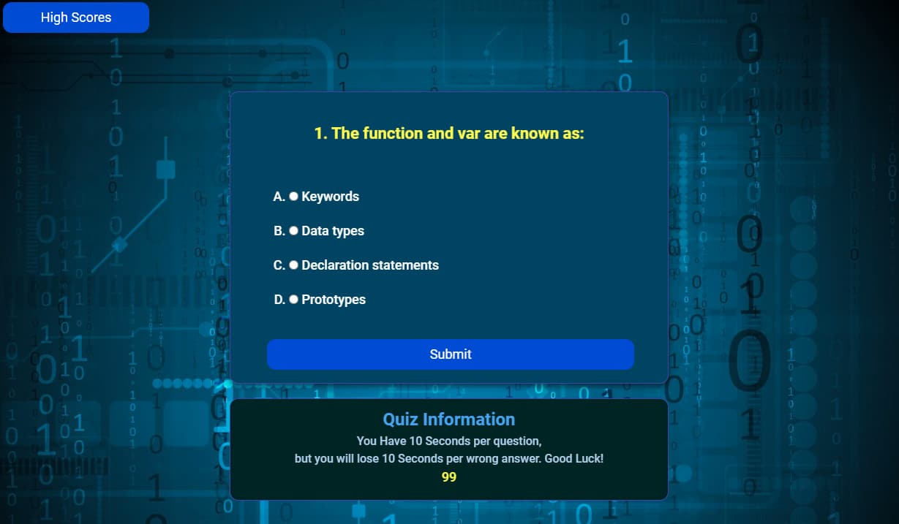
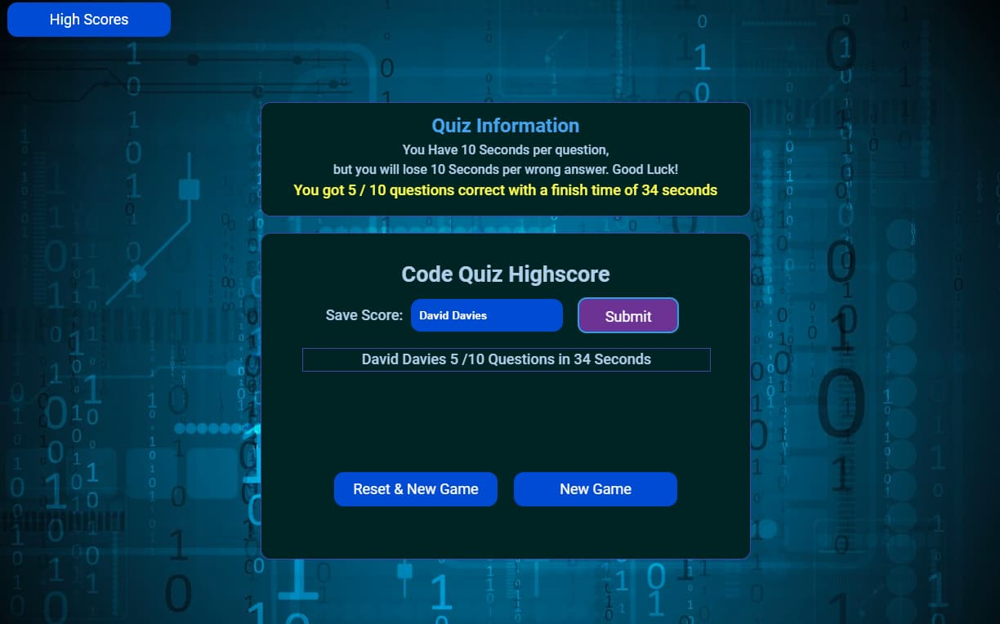
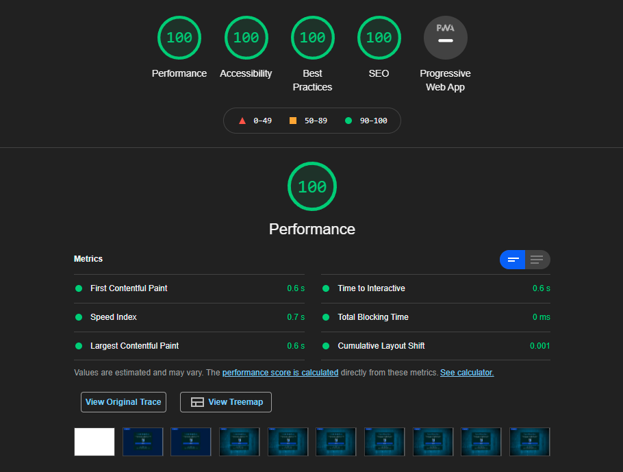

# timedCodeQuiz
A Timed Code Quiz
[TimedCodeQuiz](https://daveydavey1901.github.io/timedCodeQuiz/)

**Description**

in this weeks assignment you had to create a timed code quiz utilising HTML, CSS and JavaScript. you had to ensure the following:-
1. There had to be a start button that started the quiz.
2. A timer had to start when the quiz started.
3. You were presented with a question on start.
4. When you answered the question the next question appeared.
5. If you answered a question incorrectly you recieved a time penalty.
6. The quiz stops if all questions are answered or the time hits zero.
7. After the game completes you are able to save your initials /name and score.

**Approach / Design**

After much thought and searching the internet for example quizs i found a lot a bit plain and nothing really unique or different... many using the same style and working in the same way, i wanted to do something quite different again this made this task a bit more challenging and head spinning at times especially with the JavaScript.

So why is this different to the ones i found online... well this quiz is on a flip card.  The front comprises of the start button and quiz details, and the back of the flip card is the quiz questions.  This meant the quiz was nicly compact and very tidy looking.  The highscores were hidden until the quiz ended and then they are displayed below the quiz. 
Rather than just displaying the initials and time.  i opted to display a sentence `David 5/10 Questions with 34 Seconds left.` this made things a little difficult when it came to storing the details in local storage and then retreiving them. 

The buttons at the bottom of the highscore table allows you to start a new game or reset the highscores this just clears the local storage, and then takes you back to the start screen.

**Visuals**

Below are the screenshots from each stage of the quiz:
1.  inital screen has the quiz button and a few details about the quiz.
2.  second screen shows you one after the other 10 mulitple choice Questions.
3.  below the questions you can see a yellow countdown timer, 10seconds will be removed on a wrong answer.
4.  at the end of the quiz you can enter your name or intials and it will be saved to local storage.

**Visuals on Desktop**

| Quiz Start    |Questions     |Highscore |
|---------------|--------------|----------|
||||

**media queries to adjust quiz to smallest screens**

|iPad  |iPhone|
|------|------|
|||

**LightHouse**

i always like to run the Lighthouse in Dev tools to see if there is any tips for changing the project to increase the overall performance and accessiblity of anything i do. below is the results for this one. VERY pleasing when you see fireworks!! ALL AT 100... 

|LightHouse|
|----------|
||
 
      
**Acknowledgment**

**People to Thank**

  i have to thank my brother when it comes to the highscores saving and retrieving the data.  i was stuck for a long time and searched Stack Overflow for answers and came up with nothing.. some tips and some helpful advice and directing me where to look and questioning why i did or didn't do something... really helps you to learn and figure things out... so really appriciated.
  
  so shout out to Davin Davies aka CopperBeardy.
  
 **Sites i used for resources**
  
  [Envato Elements](https://elements.envato.com/). (paid subscription).
  
**Future Plans**

I may come back and expand on this.  i'm thinking adding different catagories to choose from HTML, CSS, JavaScipt, Node etc.  maybe look at some animations with keyframes for answering questions correctly, Getting a wrong answer, finishing the quiz, and maybe Achieving a top score.  

## License

[MIT License](LICENSE)
